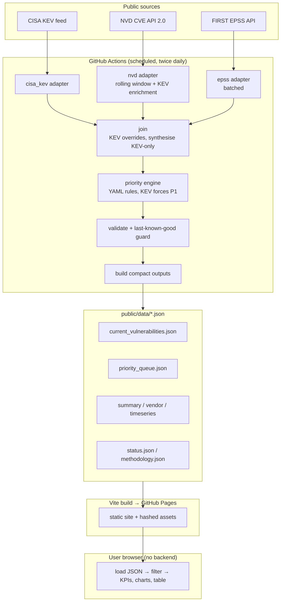

# Architecture

Cyber Risk Pulse is a **prepared-data** dashboard. All fetching, joining and
scoring happens server-side in scheduled CI; the browser only ever reads small,
static, pre-computed JSON files from the same origin.

## Key properties

- **No secrets in the browser.** The optional NVD API key is only read from an
  environment variable inside CI. Nothing sensitive reaches the client.
- **Browser never calls NVD.** It fetches only same-origin prepared files, so
  there are no rate limits, CORS issues or key exposure at view time.
- **KEV is never dropped.** KEV CVEs outside the NVD rolling window are enriched
  by direct lookup; a KEV CVE with no NVD record at all is synthesised as a
  minimal record so it still appears (flagged `no_nvd_record`).
- **Missing data is explicit.** Absent EPSS or CVSS is rendered as "n/a" and is
  never treated as zero in filters, KPIs or priority rules.
- **Fail safe.** Validation plus a record-count regression guard prevent a bad
  run from overwriting good data; the site degrades with a banner instead.

## Data flow contract

Every published record follows `schemas/vulnerability.schema.json`. The frontend
`src/types` mirror that contract exactly, and `scripts/validate_site.py` checks
the generated files against the schemas before deployment.
